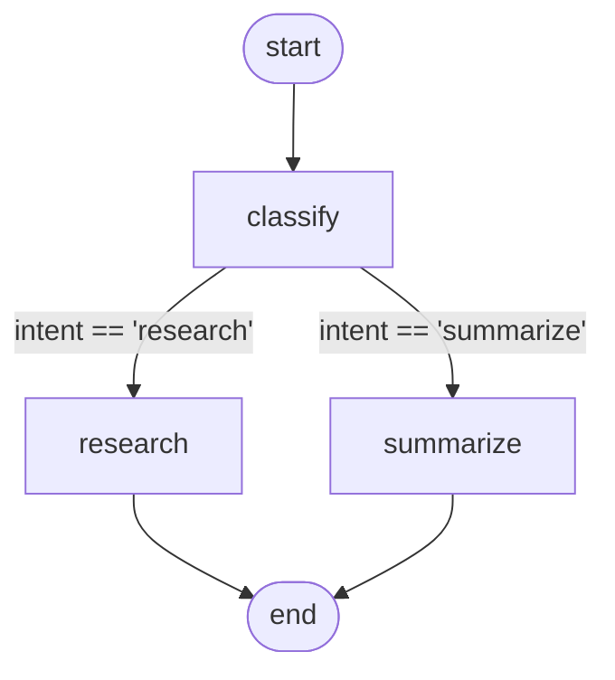

# 00 - Hello, world

The smallest possible LLM-routed pipeline: classify a query, then
either plan research on it or summarize it in one sentence. Sets the
shape every other example builds on.

## Overview

You ask a question. A classifier LLM decides whether the question
wants new information or a summary of known material. Depending on
the answer, the run either calls a research-planner node (returns
topics to investigate plus follow-up questions) or a summarizer node
(returns one sentence plus a confidence score).

The demo query is *"why did Apollo 13 abort its lunar landing?"*,
which the model usually routes to `summarize` because the facts are
well-established.

## What it teaches

- A typed [`State`](../concepts/state-and-reducers.md) holding query
  plus per-node artifacts, with three reducer policies in one model
  (`last_write_wins`, `append`, `merge`).
- The [`OpenAIProvider`](../concepts/llms.md) talking to any
  OpenAI-compatible endpoint.
- Both forms of [structured output](../concepts/llms.md): pass a
  Pydantic class as `response_schema` (`Classification`, `Summary`)
  and get an instance back on `Response.parsed`; pass a JSON Schema
  dict (`research`) and get a raw dict.
- `RuntimeConfig` for per-call sampling knobs. Every `complete()`
  passes `RuntimeConfig(temperature=0.0)` so the run is as
  reproducible as the API allows.
- A [conditional edge](../concepts/graphs.md) reading a parsed field
  off state (`route` returns `state.classification.intent`).
- A function-shaped [observer](../concepts/observability.md) attached
  after compile.

## How to run

```bash
uv sync --group examples
LLM_API_KEY=sk-... uv run python examples/00-hello-world/main.py
```

To point at a local OpenAI-compatible server, override `LLM_BASE_URL`
and (often) `LLM_MODEL`:

```bash
LLM_BASE_URL=http://localhost:8000 LLM_MODEL=Qwen2.5-7B-Instruct \
  LLM_API_KEY= \
  uv run python examples/00-hello-world/main.py
```

## The graph



Three nodes, one conditional edge. `classify` is the entry; `route`
inspects `state.classification.intent` and returns the name of the
next node.

## Reading the output

A clean run prints two lines from the observer and then the final
state:

```
classify: sources=[]
summarize: sources=['cache']

classification: intent='summarize' rationale='...'
summary: one_liner='...' confidence=0.92
sources: ['cache']
metadata: {'classified_by': 'llm', 'tool': 'summarize'}
```

- `classify: sources=[]` - the classifier ran, no sources have been
  appended yet because only the chosen follow-up node adds them.
- `summarize: sources=['cache']` - the second node ran (since the
  classifier picked `summarize`). The `append` reducer on the
  `sources` field merged the new entry into the existing list.
- `classification` and `summary` are the parsed Pydantic instances,
  not raw model output. Compare with `research_plan`, which would
  show as a plain dict if the classifier had picked `research`.
- `metadata: {...}` shows the `merge` reducer in action. Each node
  contributed one key (`classified_by`, `tool`); the final map has
  both.

If the classifier picks `research` instead, you'll see `research`
in the second observer line and a `research_plan` dict (with
`topics` and `follow_up_questions`) in the final printout.
