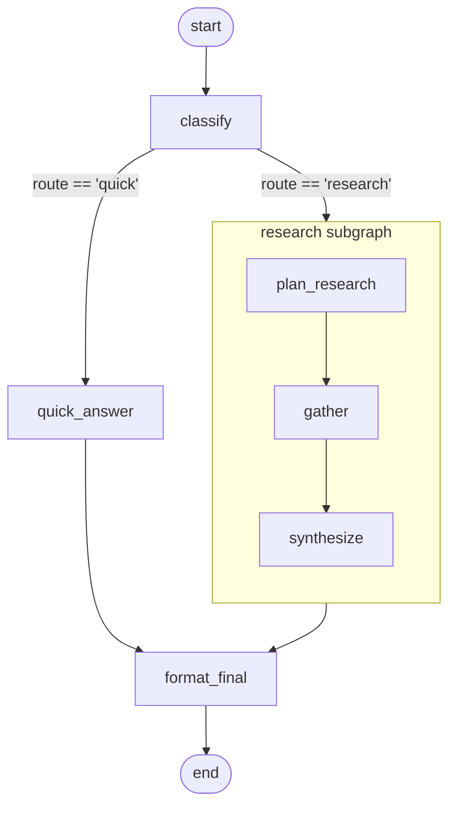

# 01 - Routing and subgraphs

A question-answering assistant. Classify the question, then either
give a one-shot quick answer or run a multi-step research
sub-pipeline, then lightly copy-edit the result.

## Overview

You ask a question. A classifier LLM decides whether it can be
answered in one or two sentences ("quick") or whether it benefits
from considering multiple angles ("research"). Quick questions go
through a single `quick_answer` node. Research questions descend
into a subgraph that plans three angles, gathers a short note for
each, and synthesizes them into a paragraph. Either way, a final
`format_final` node copy-edits the answer.

Demo questions: *"what year did the moon landing happen"*
(usually routes to quick) and *"why is the lunar south pole
strategically important?"* (usually routes to research).

## What it teaches

- [Conditional edges](../concepts/graphs.md) routing on a state
  field. `classify` writes `state.route`; the conditional edge
  function reads it and returns the next node's name.
- [Subgraph composition](../concepts/composition.md). The research
  pipeline is itself a compiled graph, wrapped as a single node in
  the outer graph via `add_subgraph_node`.
- A custom
  [`ProjectionStrategy`](../concepts/composition.md). The default
  `FieldNameMatching` only carries fields back *out* of a subgraph;
  carrying the parent's question *in* requires writing a small
  `ProjectionStrategy` class. The `QuestionProjection` here is the
  canonical pattern for non-trivial subgraph boundaries.
- The [`merge` reducer](../concepts/state-and-reducers.md) for dict
  accumulation. Every node returns a small `tallies` fragment; the
  reducer accumulates them into one dict on the final state.

## How to run

```bash
uv sync --group examples
LLM_API_KEY=sk-... uv run python examples/01-routing-and-subgraphs/main.py \
  "why is the lunar south pole strategically important?"
```

The first positional arg becomes the question. With no arg, it falls
back to the lunar-south-pole question above.

## The graph



The research box is a separate compiled graph with its own state
schema (`ResearchState`). The `QuestionProjection` carries
`parent.question` in as `subgraph.question`, and brings
`subgraph.answer` plus `subgraph.trace` back out.

## Reading the output

For a research-route run, expect:

```
question: why is the lunar south pole strategically important?
route:    research

answer:
<paragraph synthesized from three angles>

trace:   ['classify', 'plan_research', 'gather', 'synthesize', 'format_final']
tallies: {'classify_calls': 1, 'research_runs': 1, 'formatted': 1}
```

- `route` is the field `classify` wrote that the conditional edge
  read.
- `trace` lists nodes in invocation order. Subgraph nodes appear
  inline; that's the projection's `trace` field flowing back out
  through the parent's `append` reducer.
- `tallies` has one entry per node that contributed: `classify` set
  `classify_calls`, the subgraph projection's `project_out` set
  `research_runs`, `format_final` set `formatted`. `quick_answer`
  would have contributed `quick_answers: 1` if the run had gone the
  other way.

For a quick-route run, `trace` drops to `['classify',
'quick_answer', 'format_final']` and `tallies` has
`quick_answers: 1` in place of `research_runs: 1`.
