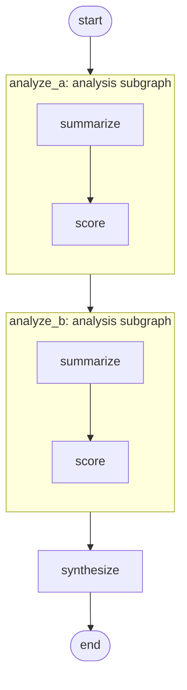

# 02 - Explicit subgraph mapping

Compare two topics by running the *same* compiled analysis subgraph
on each, with each call site writing into disjoint parent fields.
This is the canonical use of `ExplicitMapping`.

## Overview

You give the pipeline two topics ("Apollo 11" vs "Apollo 17", or
"Apollo program vs Artemis program"). One compiled subgraph
(`summarize → score`) is registered twice in the outer graph. The
first registration analyzes topic A and writes its results into
`a_summary` / `a_score`; the second analyzes topic B and writes
into `b_summary` / `b_score`. A final `synthesize` node reads both
sides and renders a verdict.

Without explicit mapping the two sites would both write to a single
`parent.summary` field under default name matching, and the second
call would clobber the first.

## What it teaches

- [`ExplicitMapping`](../concepts/composition.md) for reusing one
  compiled subgraph at multiple parent sites with disjoint parent
  fields. Each site declares its own `inputs` and `outputs` dicts;
  the same compiled subgraph value is registered twice.
- The encapsulation property that makes this work: the subgraph
  speaks in neutral field names (`topic`, `summary`, `score`) and
  has no idea which side of the comparison it's running for. The
  mapping at each call site is what wires the subgraph's neutral
  names to the parent's per-side fields.
- The contrast with example 01: there a custom
  `ProjectionStrategy` carried one field in. Here the two sites
  need to be similar-but-different, and `ExplicitMapping` is the
  zero-boilerplate way to express that.

## How to run

```bash
uv sync --group examples
LLM_API_KEY=sk-... uv run python examples/02-explicit-subgraph-mapping/main.py "Apollo 11" "Apollo 17"
```

Or pass a single `"X vs Y"` arg, or no args (defaults to
`"Apollo 11"` vs `"Apollo 17"`).

## The graph



Both subgraph boxes are the *same* compiled value, registered twice
under different names with different mappings. The `analyze_a` site
maps `parent.topic_a → subgraph.topic` and back out as `summary →
a_summary`, `score → a_score`. The `analyze_b` site does the same
thing on the B-side parent fields.

## Reading the output

```
topic A: Apollo 11
  summary: <one-sentence summary of Apollo 11>
  score:   8/10

topic B: Apollo 17
  summary: <one-sentence summary of Apollo 17>
  score:   7/10

verdict:
<paragraph picking a winner or calling it a tie, citing the summaries>

trace: ['summarize', 'score', 'summarize', 'score', 'synthesize']
```

- The per-side summary and score fields are populated by separate
  invocations of the same subgraph, routed by the mappings.
- `trace` shows the subgraph's nodes running **twice**, interleaved
  with the outer `synthesize`. Both invocations contribute to the
  same parent `trace` list because each `outputs` mapping includes
  `"trace": "trace"`.
- `verdict` is whatever `synthesize` produced from reading both
  sides. The outer node knows nothing about which side ran first;
  it just reads four parent fields.
