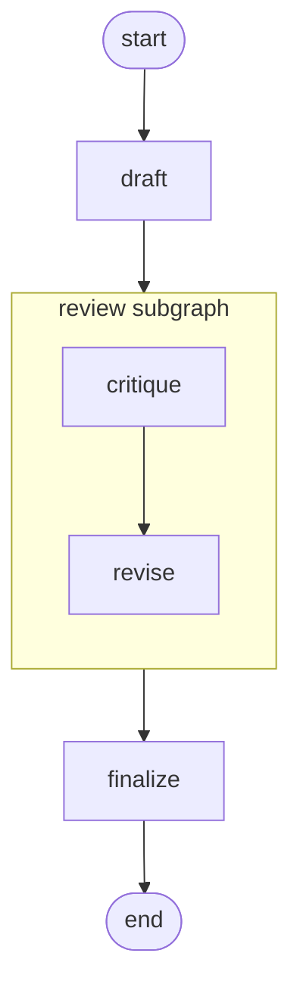

# 03 - Observer hooks

Add observability to a `draft → review → finalize` pipeline without
touching any node code. Three observer flavors run side-by-side: a
console tracer, a per-invocation metrics collector, and the
OpenTelemetry observer wired to a console span exporter.

## Overview

You ask a question. The outer graph drafts an answer, then descends
into a `review` subgraph that critiques the draft and produces a
revision, then runs a `finalize` node that marks the run done.

Three observers watch every node boundary:

1. A **graph-attached console tracer** prints one structured line
   per node boundary to stderr.
2. An **invocation-scoped metrics collector** counts events,
   errors, and unique namespaces seen on *this* call only.
3. The **`OTelObserver`** opens and closes spans on a private
   `TracerProvider`, and a console span exporter prints the JSON
   span at close.

The observers share one `Observer` Protocol; nothing in the node
bodies knows or cares that they're attached.

## What it teaches

- [`attach_observer`](../concepts/observability.md) for
  graph-attached observers (fire on every invocation until removed).
- The `observers=[...]` kwarg on `invoke()` for invocation-scoped
  observers (fire only for that call).
- The [`NodeEvent`](../concepts/observability.md) shape: `phase`,
  `step`, `namespace`, `pre_state`, `post_state`, `error`.
- Namespace chaining across subgraph boundaries. The subgraph's
  events arrive with their parent node name prepended to the
  namespace tuple.
- Function-shaped versus class-shaped observers (both satisfy the
  Protocol structurally).
- The [`OTelObserver`](../concepts/observability.md) from the
  `[otel]` extra, registered like any other observer. Same hook,
  spans instead of prints.
- The `await graph.drain()` requirement for short-lived processes:
  events go through a background queue, and `invoke()` returns when
  the graph hits `END`, not when the queue empties.

## How to run

```bash
uv sync --group examples --all-extras
LLM_API_KEY=sk-... uv run python examples/03-observer-hooks/main.py \
  "what year did the moon landing happen"
```

`--all-extras` pulls in `opentelemetry-sdk` for the OTel observer.
The first positional arg becomes the question.

## The graph



The `review` subgraph is wired with an `ExplicitMapping` that
carries `draft` IN; the default field-name matching brings
`revised` and `trace` back OUT.

## Reading the output

The console tracer prints one line per boundary to **stderr** in
`[step=N] namespace → fields_changed` form, interleaved with the
OTel exporter's JSON spans on **stdout**, followed by the final
state printout. A trimmed run looks like:

```
[step=1] draft → {'draft': '...', 'trace': ['draft']}
{"name": "draft", "context": {...}, "kind": "SpanKind.INTERNAL", ...}
[step=2] review.critique → {'critique': '...', 'trace': ['critique']}
[step=3] review.revise → {'revised': '...', 'trace': ['critique', 'revise']}
[step=4] finalize → {'trace': ['draft', 'critique', 'revise', 'finalize']}

question: what year did the moon landing happen
draft:   <two or three sentence draft>
revised: <copy-edited version>

per-invocation metrics:
  events seen:        4
  errors observed:    0
  unique namespaces:  3
  trace order:        ['draft', 'critique', 'revise', 'finalize']
```

- **`namespace` chains across subgraphs.** `draft` and `finalize`
  fire at the top level (single-element namespace). `critique` and
  `revise` fire inside the subgraph and arrive with namespace
  `('review', 'critique')` / `('review', 'revise')`, which the
  tracer joins with `.`.
- **`fields_changed` is the diff** between `pre_state` and
  `post_state`. Each node's "what did it do?" is visible without
  the node logging anything itself.
- **The metrics observer is per-invocation.** It counts only events
  from this single `invoke()` call. The tracer and OTel observer
  would persist across further `invoke()` calls on the same
  compiled graph.
- **OTel spans appear as JSON on stdout** because we wired a
  `ConsoleSpanExporter`. The `OTelObserver` uses a private
  `TracerProvider`, so it does not pollute any global OTel setup
  the surrounding application might have.
