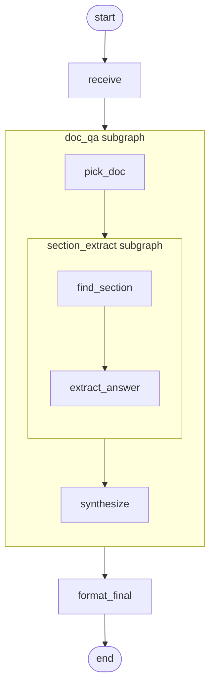

# 04 - Nested subgraphs

Question answering against a tiny baked-in document corpus, with
two levels of subgraph nesting: outer coordinator, middle doc-QA,
inner section-extract.

## Overview

You ask a question. A small in-memory corpus of three documents
(Apollo 11, Apollo 13, Artemis II) sits at module level. The
pipeline runs in three layers:

1. **Outer (coordinator).** Receives the question, delegates to the
   doc-QA subgraph, polishes the final answer.
2. **Middle (doc-QA).** Picks the single most relevant document
   from the corpus, hands it to the section-extract subgraph, then
   synthesizes a clean answer from what came back.
3. **Inner (section-extract).** Given one document and the
   question, finds the relevant paragraph and pulls out the answer
   text.

Each layer has its own state schema scoped to its job: the outer
cares about a question and a final answer, the middle picks one
document and synthesizes, the inner narrows to a paragraph and
extracts a span.

## What it teaches

- [Nested subgraphs](../concepts/composition.md): a compiled
  subgraph is just a value, so it can be embedded inside another
  compiled subgraph, recursively.
- Layer-scoped state schemas. Each compiled subgraph has its own
  `State` subclass. Boundaries between layers are explicit
  projections, not aliased name spaces.
- [`ExplicitMapping`](../concepts/composition.md) at every
  parent ↔ child boundary, plumbing the question down through three
  layers and the answer back up.
- A depth-aware [observer](../concepts/observability.md). The
  observer prints `namespace` as a `>`-joined breadcrumb and indents
  by depth. Useful for seeing the descent into nested subgraphs and
  the return.

## How to run

```bash
uv sync --group examples
LLM_API_KEY=sk-... uv run python examples/04-nested-subgraphs/main.py \
  "what happened on Apollo 13?"
```

Other demo questions: *"what year did humans first land on the
moon?"* (routes to Apollo 11) and *"who was on the Artemis II
crew?"* (routes to Artemis II). With no arg the default is the
moon-landing year question.

## The graph



The doc-QA box wraps the section-extract box. The outer's
`ExplicitMapping` carries `question` down into `doc_qa` and brings
`answer` plus `trace` back. Inside `doc_qa`, a second
`ExplicitMapping` carries `question` plus `selected_body` into the
section-extract subgraph (as its `question` and `doc_body` fields)
and brings the extracted text back as `raw_answer`.

## Reading the output

The depth observer indents each event by its namespace depth, so
the descent and return are visually obvious. A trimmed run:

```
[step 1] depth=1  receive
    started   question='what happened on Apollo 13?' answer=''
    completed question='what happened on Apollo 13?' answer=''

  [step 2] depth=2  doc_qa > pick_doc
      started   question='...' selected_title='' selected_body=''
      completed question='...' selected_title='Apollo 13' selected_body='...'

    [step 3] depth=3  doc_qa > section_extract > find_section
        started   question='...' doc_body='...' relevant_section=''
        completed question='...' doc_body='...' relevant_section='...'

    [step 4] depth=3  doc_qa > section_extract > extract_answer
        started   relevant_section='...' extracted=''
        completed relevant_section='...' extracted='aborted after an oxygen tank ruptured'

  [step 5] depth=2  doc_qa > synthesize
      started   raw_answer='aborted after...' answer=''
      completed raw_answer='aborted after...' answer='Apollo 13's lunar landing was aborted after...'

[step 6] depth=1  format_final
    started   answer='Apollo 13's lunar landing was aborted...'
    completed answer='Apollo 13's lunar landing was aborted after an oxygen tank ruptured.'

Answer: Apollo 13's lunar landing was aborted after an oxygen tank ruptured.

Trace: ['receive', 'pick_doc', 'find_section', 'extract_answer', 'synthesize', 'format_final']
```

- **`depth`** counts the namespace tuple. Top-level nodes are
  depth=1; doc-QA subgraph nodes are depth=2; section-extract nodes
  are depth=3. The indent makes the levels obvious at a glance.
- **`namespace`** chains: `doc_qa > section_extract > find_section`
  means "find_section running inside section_extract running inside
  doc_qa." Observability backends can use this same chain for
  trace correlation.
- **`trace`** in final state shows the order of node completions,
  flattened across all layers. Each subgraph's projection
  contributed its trace back to the parent through the parent's
  `append` reducer; the outer's `trace` ends up as the concatenation.
