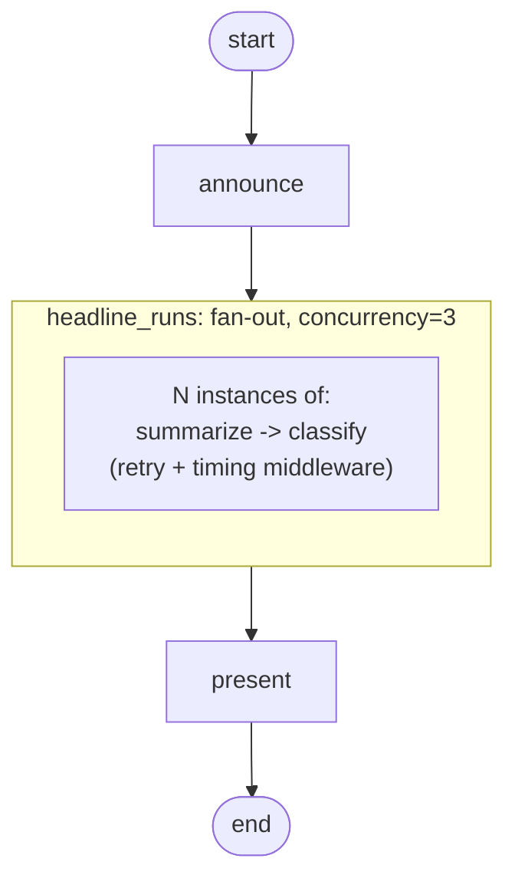

# 05 - Fan-out with retry

Summarize a batch of lunar-mission headlines in parallel, with
per-headline retry and timing middleware wrapping each instance's
subgraph run.

## Overview

You have a list of news headlines. Each one needs a one-sentence
summary plus a topic tag. The headlines are independent, so the
work parallelizes naturally: dispatch one per-headline subgraph
run per headline, bounded concurrency, retry transient LLM failures
on a per-instance basis.

The per-instance subgraph is small (`summarize → classify`) and
would also run standalone against a single headline. Fan-out
multiplies it out across the batch.

A second mode, controlled by the `COLLECT_MODE` env var, exercises
the failure path. With `COLLECT_MODE=1` the demo prepends a
sentinel headline that always raises `ProviderUnavailable`; under
`error_policy="collect"` the failure lands in
`state.instance_errors` and the rest of the batch completes.

## What it teaches

- [`add_fan_out_node`](../concepts/fan-out.md) in `items_field`
  mode: one subgraph invocation per element of `state.headlines`.
  `item_field` names the per-instance input field on the subgraph's
  state.
- `collect_field` and `extra_outputs` for harvesting per-instance
  results into parent lists. The two lists (`summaries`, `topics`)
  end up index-aligned.
- `instance_middleware`: middleware wrapped around each instance's
  subgraph run. `RetryMiddleware` (3 attempts, deterministic
  backoff) plus `TimingMiddleware` (captures duration per
  instance). Retries are per-instance: a transient failure on
  headline 3 doesn't restart 0-2.
- `concurrency=3` capping how many instances run in flight at once.
- `error_policy="fail_fast"` (default, first exhausted-retry
  failure aborts the batch) vs `"collect"` (failures land in
  `errors_field` and the batch produces partial results).
- A `fan_out_config_observer` reads
  `NodeEvent.fan_out_config` on the fan-out node's dispatch event,
  recording the resolved `item_count` / `concurrency` /
  `error_policy` at runtime. Inner-instance events carry
  `fan_out_index` but not the config.

## How to run

```bash
uv sync --group examples
LLM_API_KEY=sk-... uv run python examples/05-fan-out-with-retry/main.py
```

To exercise the collect path with a synthetic failure:

```bash
COLLECT_MODE=1 LLM_API_KEY=sk-... \
  uv run python examples/05-fan-out-with-retry/main.py
```

## The graph



`headline_runs` is the fan-out node. At dispatch time it expands
into N copies of the per-instance subgraph, one per headline.
`RetryMiddleware` and `TimingMiddleware` wrap each instance.

## Reading the output

A clean default-mode run (`fail_fast`, all instances succeed):

```
========================================================================
Summarizing 5 headlines in parallel (concurrency=3)
error_policy='fail_fast'
========================================================================

  [observer] fan-out node 'headline_runs' dispatching: item_count=5 concurrency=3 error_policy='fail_fast'

Results (in input order):

  [0] Artemis II splashes down in Pacific after ten-day lunar flyby
       summary: <one-sentence rewrite>
       topic:   crew

  [1] NASA pauses Lunar Gateway program in favor of crewed surface base
       summary: <one-sentence rewrite>
       topic:   policy

  ...

Per-instance timings (in completion order):
  #0   812.3 ms  outcome=success
  #1   941.7 ms  outcome=success
  #2   876.2 ms  outcome=success
  #3   903.4 ms  outcome=success
  #4   1012.8 ms  outcome=success

  wall-clock total:         2089.3 ms
  sum of per-instance:      4546.4 ms
  → concurrency speedup:    2.18x
```

- **The observer line** is the `fan_out_config_observer` printing
  the dispatch-time config. Useful when `count` or `concurrency`
  are callable resolvers whose runtime value isn't visible in code.
- **Per-input order vs completion order.** The result loop walks
  `final.headlines` in input order; `final.summaries` and
  `final.topics` are index-aligned with it. The timings list is in
  completion order, not input order (instance 2 may finish before
  instance 1 under concurrency).
- **Concurrency speedup.** `sum of per-instance / wall-clock`. A
  speedup near `concurrency` indicates the work parallelized well;
  a value near 1.0 indicates concurrency didn't help (the upstream
  serialized you, or instances themselves are short).

With `COLLECT_MODE=1`, the output includes the sentinel headline
at index 0 with a `(failed after retries; ...)` marker, plus a
`Captured 1 per-instance error(s):` block listing the failed
`fan_out_index` and error category. The other instances complete
as usual.
