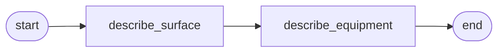

# 07 - Multimodal prompt

Two independent analyses of a lunar-mission photograph using
versioned prompt templates, a fallback prompt backend, and a
multimodal user message that carries both text and image.

## Overview

Given a photograph of a lunar mission (default: Buzz Aldrin on the
lunar surface during Apollo 11), run two independent analyses
against the same image:

- **describe-surface**: describe what's visible of the lunar
  surface.
- **describe-equipment**: identify the equipment in the frame.

Both prompts take the mission name as their only variable; neither
depends on the other's output. Both rendered prompts are grouped
under one observability `PromptGroup` so a trace UI can show the
analyses as one logical unit.

The image source can be a URL (default) or a local file. Setting
`IMAGE_PATH` switches the demo to inline base64 transport.

## What it teaches

- [`PromptManager`](../concepts/prompts.md) configured with two
  `FilesystemPromptBackend`s: a primary `prompts/` directory and a
  fallback `prompts_fallback/` directory. The manager tries them in
  order on every `get`; the fallback fires only when the primary
  raises `PromptStoreUnavailable`. Typical production shape is
  "remote primary + filesystem fallback".
- [`FilesystemPromptBackend`](../concepts/prompts.md) with the
  `<root>/<label>/<name>.j2` layout, here under the `production`
  label.
- [`PromptGroup`](../concepts/prompts.md) wrapping the two prompt
  results under one identifier. `with_active_prompt_group` and
  `with_active_prompt` are nested ContextVar scopes that propagate
  group and per-call prompt identifiers to observers.
- [Multimodal `UserMessage`](../concepts/llms.md) with a list of
  content blocks (`TextBlock` + `ImageBlock`), and the two image
  sources (`ImageSourceURL` for hosted images, `ImageSourceInline`
  with base64 data for local files).

## How to run

```bash
uv sync --group examples
LLM_API_KEY=sk-... uv run python examples/07-multimodal-prompt/main.py
```

To use a local file instead of the default URL:

```bash
IMAGE_PATH=./photo.jpg LLM_API_KEY=sk-... \
  uv run python examples/07-multimodal-prompt/main.py
```

Override `MISSION` to set the prompt variable for a different
mission name:

```bash
MISSION="Apollo 17" LLM_API_KEY=sk-... \
  uv run python examples/07-multimodal-prompt/main.py
```

The model must be vision-capable. `gpt-4o-mini` (the default) is.

## The graph



Two sequential nodes. Each fetches its own prompt from the
manager, renders it with the `mission` variable, builds a
multimodal `UserMessage` with the rendered text plus the image
block, and calls the LLM inside a `with_active_prompt(rendered)`
scope. Both nodes run inside a `with_active_prompt_group(group)`
scope set up by `main()`.

## Reading the output

```
========================================================================
Lunar-mission image analysis (surface + equipment)
========================================================================

  mission:   Apollo 11
  image:     https://upload.wikimedia.org/.../Aldrin_Apollo_11_original.jpg (url)

  group:                lunar-image-analysis
  describe-surface:     describe-surface @ <version-hash>
  describe-equipment:   describe-equipment @ <version-hash>

  surface description:
    <model's description of the lunar regolith, footprints, terrain, etc.>

  equipment description:
    <model's identification of the LM, EASEP, suit, camera, etc.>
```

- **`describe-surface @ <hash>`** lines show the prompt identifiers
  resolved through the manager. The hash is the template digest;
  it changes if the template file is edited. Observability backends
  use this to correlate LLM-call spans to specific template
  versions.
- **`group: lunar-image-analysis`** is the group identifier from
  `PromptGroup`. Inside the `with_active_prompt_group` scope, OTel
  observers would stamp this on every LLM-call span fired by either
  node.
- **Per-call prompt scope**. The inner `with_active_prompt(rendered)`
  block adds the per-call identifiers (name, version, label,
  template_hash, rendered_hash) on top of the group identifier. Two
  layers, both stamped on the same span.
- **Fallback path** isn't visible in a clean run because the
  primary backend serves both prompts. To observe it, point the
  primary at a directory missing one of the templates and re-run;
  the manager logs a fallback transition and the call succeeds with
  the variant from `prompts_fallback/`.
