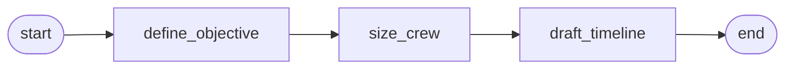
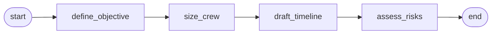

# 08 - Checkpointing and migration

A lunar-mission planning pipeline that writes a SQLite checkpoint
after every step, survives a simulated mid-pipeline crash, and then
resumes the saved invocation under an upgraded state schema with a
v1->v2 migration backfilling new fields.

## Overview

A planning pipeline drafts a lunar mission plan in three steps:

1. `define_objective` - state the primary objective in one
   sentence.
2. `size_crew` - pick a crew size between 2 and 8.
3. `draft_timeline` - draft a one-sentence timeline.

The graph is wired with a `SQLiteCheckpointer` in JSON mode, so the
engine writes a record after every `completed` event. The demo
stages two reliability stories on top of that wiring:

**Phase 1 - crash and resume.** The first attempt at the v1 graph
runs `define_objective` to completion (its checkpoint saves), then
`size_crew` raises a simulated transient failure - the kind of
mid-LLM-call infrastructure blip you can't engineer away in
production (OOM kill, pod preemption, network drop). `NodeException`
reaches the `invoke()` boundary. A second `invoke()` call passes
`resume_invocation=<id>` of the same saved record. The engine reads
the record, skips `define_objective` (its position is already in
`completed_positions`), retries `size_crew`, runs `draft_timeline`,
and the pipeline finishes.

**Phase 2 - migration on resume.** Then "some time later" - in the
same script for demo purposes - a v2 schema lands. It adds a
`risk_assessment` field and a new `assess_risks` node at the end. A
migration function backfills `risk_assessment=""` for v1 records.
The v2 graph resumes the (now-completed) v1 invocation, the
migration runs once on load, and execution continues at
`assess_risks`. The original three v1 nodes do not re-execute.

## What it teaches

- **[`SQLiteCheckpointer(path, serialization="json")`](../concepts/checkpointing.md)**
  writes records to a SQLite file synchronously after every node
  completes. The save returns before the next node starts, so a
  crash mid-next-node can't lose the previous node's record. JSON
  is the migration-eligible serialization; `pickle` mode is faster
  but can't bridge schemas.
- **[`with_checkpointer`](../concepts/checkpointing.md)** wires the
  checkpointer into a `GraphBuilder`. The engine fires a save at
  every `completed` event for outermost and subgraph-internal
  nodes.
- **[`NodeException` at the `invoke()` boundary](../concepts/graphs.md)**.
  When a node raises, the engine wraps the cause in `NodeException`
  and re-raises it from `invoke()`. The caller catches it; the
  checkpointer's record of the *previously* completed nodes is
  already durable on disk. `exc.__cause__` carries the original
  exception, `exc.node_name` identifies the failing node, and
  `exc.recoverable_state` carries the state as it was just before
  the failing node ran.
- **[`invoke(state, resume_invocation=<id>)`](../concepts/checkpointing.md)**
  resumes from a saved record. The engine reads the record, skips
  nodes whose `completed` events are already in
  `completed_positions`, and continues at the first uncompleted
  node. The retried node runs from a clean slate against the
  loaded state - whatever transient condition caused the previous
  failure can resolve cleanly.
- **[`State.schema_version`](../concepts/checkpointing.md)** as a
  `ClassVar[str]` declaration. Empty string opts the class out of
  migration support; any non-empty value opts it in.
- **[`with_state_migration(from_version, to_version, migrate)`](../concepts/checkpointing.md)**
  registers one edge of the migration chain. The `migrate`
  callable is pure (dict in, dict out, no I/O). The engine applies
  it on load when the saved record's `schema_version` doesn't
  match the current state class's.
- **The migration registry's BFS resolution.** With a v3 schema
  and two migration edges (`v1->v2`, `v2->v3`), the registry walks
  the shortest chain automatically. A v1 record loaded under a v3
  graph runs `v1->v2` then `v2->v3` without caller-side
  composition.

## How to run

```bash
uv sync --group examples
LLM_API_KEY=sk-... uv run python examples/08-checkpointing-and-migration/main.py
```

The SQLite database is created in a `TemporaryDirectory` that's
cleaned up automatically. The demo runs both phases in one
invocation so you can see the crash, the resume, and the migration
end-to-end without manual orchestration.

## The graph

V1 graph:



V2 graph (adds `assess_risks` at the end):



The v2 graph also registers `with_state_migration("v1", "v2",
migrate_v1_to_v2)`. The migration function takes the saved state
as a plain dict and returns a dict at the new schema (here, just
`{**state_dict, "risk_assessment": ""}`).

## Reading the output

```
========================================================================
Phase 1 - invoke v1 graph; size_crew crashes; resume picks up
========================================================================

  destination:       Lunar South Pole
  checkpoint db:     /tmp/oa-checkpoint-demo-.../checkpoints.sqlite

  first attempt:
    NodeException at node 'size_crew': simulated transient mid-pipeline crash before size_crew completed
    saved invocation_id:    <uuid>
    completed nodes:        ['define_objective']

  second attempt (resume from saved invocation):
    objective:        <objective sentence>
    crew_size:        4
    timeline:         <timeline sentence>
    trace:            ['define_objective', 'size_crew', 'draft_timeline']

  Each node name appears exactly once across two invoke() calls.
  define_objective is in trace from the first attempt (its append
  survived the crash via the synchronous checkpoint); size_crew +
  draft_timeline are from the resumed attempt. size_crew has no
  duplicate entry because its first call raised before returning
  a state update.

========================================================================
Phase 2 - invoke v2 graph with resume; v1->v2 migration runs
========================================================================

  v2 adds:    risk_assessment field + assess_risks node
  migration:  backfills risk_assessment='' for v1 records

  v2 result after resume:
    objective:        <same objective sentence>
    crew_size:        4
    timeline:         <same timeline sentence>
    risk_assessment:  <new sentence from assess_risks>
    trace:            ['define_objective', 'size_crew', 'draft_timeline', 'assess_risks']

  v2's trace appends 'assess_risks' to the v1 entries the migration
  preserved. Each v1 node appears exactly once (no duplicates from
  the v2 graph re-running them) because completed_positions skipped
  them. Only assess_risks was new work in phase 2.
```

- **`NodeException at node 'size_crew'`** is the signal that the
  engine caught the simulated crash and surfaced it at the
  `invoke()` boundary. The caller's `try / except NodeException`
  is the canonical error boundary for nodes; `exc.__cause__`
  carries the original `RuntimeError`.
- **`completed nodes: ['define_objective']`** on the loaded
  record proves the durability claim. The `define_objective`
  checkpoint is on disk before `size_crew` even started; the
  crash can't take that record with it. The example projects
  `record.completed_positions` (a tuple of `NodePosition` entries
  carrying namespace, node_name, step, attempt_index) down to
  just the node names for display.
- **`trace: ['define_objective', 'size_crew', 'draft_timeline']`**
  after the resume is the cross-attempt continuity proof. The
  resumed invoke starts from the saved state (so `trace` already
  carries the first attempt's `define_objective` entry), and the
  `append` reducer accumulates entries from the post-crash nodes
  on top. Each node name appears exactly once: `define_objective`
  ran once on the first attempt; `size_crew` ran twice but only
  the second call returned a state update (the first call raised
  before its return); `draft_timeline` ran once on the resume. The
  *absence* of duplicates is the engine-side skip-set's signature.
- **`trace: [..., 'assess_risks']`** on the v2 result extends the
  v1 entries with one new entry. The v1 nodes did not re-execute
  on the v2 resume; their `completed_positions` entries told the
  engine they were already done. The migration preserved their
  trace entries (via `{**state_dict, ...}`), and the v2 pipeline
  began at the first uncompleted position (`assess_risks`).
- **`crew_size: 4`** and the other v1 fields are present on the v2
  result because the migration preserved them via `{**state_dict,
  ...}`. A migration that *changed* an existing field (e.g.,
  splitting `name` into `first_name` + `last_name`) would
  transform the dict more thoroughly.
- **JSON serialization** is what made this possible. With
  `serialization="pickle"`, the saved record would be a pickled
  v1 instance that couldn't be re-deserialized against
  `MissionPlanStateV2`; JSON makes the saved state a plain dict
  that the migration function can rewrite freely.
