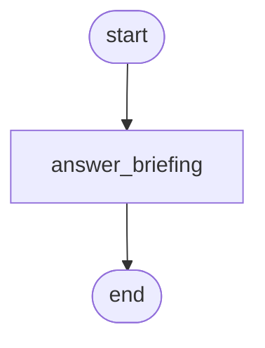

# 10 - Langfuse observability

Send LLM call observability to Langfuse natively: Trace at the top,
Span observations for graph nodes, Generation observations with input,
output, token usage, model parameters, and a native link back to the
prompt entity the call rendered from.

## Overview

A mission-briefing assistant answers questions about Apollo and Artemis
missions. The pipeline fetches a versioned prompt template, renders it
with the user's question, sends the rendered messages to the model,
and stores the response. The Langfuse observer captures the full call
shape as the graph runs.

The demo's prompt backend stubs a Langfuse-source by attaching a
sentinel `langfuse_prompt` reference to the rendered prompt. The
Generation observation reads that reference and links back to the
prompt entity, exactly what you'd see in a production Langfuse
dashboard threading "this generation came from prompt v7" without any
manual wiring at the call site.

## What it teaches

- [`LangfuseObserver`](../concepts/observability.md#langfuse-mapping-opt-in)
  attaches like any other observer; nothing in the node code knows or
  cares about which backend is recording.
- The `LangfuseClient` Protocol decouples the observer from the SDK.
  The bundled `InMemoryLangfuseClient` recorder is the test/demo
  shape; production passes a real `langfuse.Langfuse()` instance (or
  a thin adapter; see [Reading the output](#reading-the-output)
  below).
- Prompt linkage through
  [`Prompt.observability_entities`](../concepts/prompts.md#backend-keyed-observability-entity-references):
  a prompt backend that exposes a Langfuse Prompt entity reference
  surfaces it on every Generation that renders from that prompt.
  Filesystem / in-memory backends without that reference work too,
  they just produce metadata-only linkage.
- `disable_llm_payload=False` opt-in for capturing input messages +
  output content on Generation observations. Default-off is the
  privacy posture; the demo deliberately flips it.
- `correlation_id` cross-cutting metadata on the Trace and every
  Observation: the join key if you're also running an OTel observer
  alongside.

## How to run

```bash
uv sync --group examples
LLM_API_KEY=sk-... uv run python examples/10-langfuse-observability/main.py \
  "what year did Apollo 11 land"
```

The first positional arg becomes the question. The demo uses an
in-memory recorder so no Langfuse account is needed.

## The graph



A single-node graph: fetch the prompt, render with the question, call
the LLM under `with_active_prompt(...)`, store the response. The
single node is deliberate; the value is in the captured Trace shape,
not the graph topology.

## Reading the output

After the answer prints, the script renders the captured Langfuse
Trace + Observation tree:

```
question: what year did Apollo 11 land
answer:   Apollo 11 landed on the Moon on July 20, 1969 ...
prompt:   mission-briefing v7

─── captured Langfuse trace ─────────────────────────────────
Trace id=01234567-89ab-...
      name='answer_briefing'
      metadata={correlation_id='...', entry_node='answer_briefing', spec_version='0.38.0'}
  [span] 'answer_briefing' level=DEFAULT
    metadata={attempt_index=0, correlation_id='...', namespace=['answer_briefing'], step=0}
    [generation] 'openarmature.llm.complete' level=DEFAULT
      metadata={correlation_id='...', finish_reason='stop', prompt={...},
                response_id='...', response_model='gpt-4o-mini-2024-...',
                system='openai'}
      model='gpt-4o-mini'
      usage=input:48 output:32 total:80
      prompt_entity_link='lf-prompt-mission-briefing-v7'
      output='Apollo 11 landed on the Moon on July 20, 1969 ...'
```

- **Trace name = entry node name** by default. The caller-supplied
  invocation-label path (a per-`invoke()` argument that overrides the
  default) ships with proposal 0034's caller-metadata work.
- **Span observation per node.** `answer_briefing` is the only node
  here; a multi-node graph would produce a tree of nested Span
  observations under the Trace.
- **Generation observation per LLM call.** Carries `model`, `usage`,
  `output`, and the prompt-identity metadata. In a production Langfuse
  dashboard this is what the "Generation" detail view renders.
- **`prompt_entity_link`** is the value `Prompt.observability_entities['langfuse_prompt']`
  carried: a sentinel string in this demo, a real Langfuse SDK Prompt
  object in production. When the backend doesn't surface the reference
  (e.g., a filesystem backend), the link is absent but the
  `metadata.prompt` map (name, version, label, hashes) still appears
  for traceability.

## Swapping to a real Langfuse SDK

Install the optional extras:

```bash
pip install 'openarmature[langfuse]'
```

Wrap the SDK client with `LangfuseSDKAdapter` and pass it to the
observer:

```python
from langfuse import Langfuse
from openarmature.observability.langfuse import (
    LangfuseObserver,
    LangfuseSDKAdapter,
)

langfuse_client = Langfuse(
    public_key="pk-lf-...",
    secret_key="sk-lf-...",
    host="https://cloud.langfuse.com",
)
observer = LangfuseObserver(
    client=LangfuseSDKAdapter(langfuse_client),
    disable_llm_payload=False,
)
```

The adapter bridges `langfuse>=4.6,<5`'s unified `start_observation`
API onto OA's four-method `LangfuseClient` Protocol. v4 has no
explicit trace creation (traces are auto-created from observations);
the adapter caches trace info from `.trace()` and applies it via
`propagate_attributes` around EVERY observation under that trace_id.
Propagating on every observation keeps v4's last-attribute-wins
display logic from clobbering the trace's display name when later
observations land without the attribute set.

Validated against `langfuse>=4.6,<5`. v2.x and v3.x are NOT
supported; supply your own adapter against the same four-method
Protocol if you need to stay on an older version.

For prompt linkage: in production, the
`Prompt.observability_entities['langfuse_prompt']` value is the SDK's
own Prompt-entity object (returned by `langfuse_client.get_prompt(...)`)
rather than the sentinel string this demo uses. The observer passes
that value straight through to the SDK's `generation(..., prompt=...)`
argument, which is what the SDK uses to establish the native link.

## Composition with OTel

Both observers consume the same `NodeEvent` stream and can be attached
together:

```python
graph.attach_observer(OTelObserver(span_processor=batch))
graph.attach_observer(LangfuseObserver(client=langfuse_client))
```

Their `disable_llm_spans` / `disable_llm_payload` flags are
independent. The `correlation_id` cross-cutting attribute is the join
key: find a slow Generation in Langfuse, search for the
`correlation_id` in OTel logs to see the surrounding infrastructure
activity.
