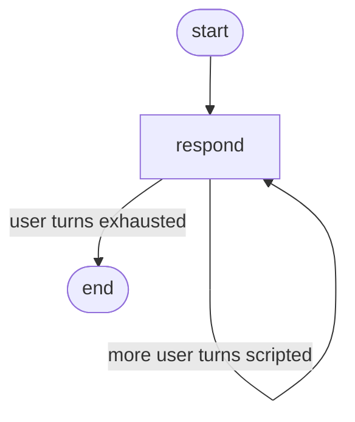

# Chat with multi-turn memory and a multimodal turn

!!! info "Source"
    [https://github.com/LunarCommand/openarmature-python/blob/main/examples/chat-with-multimodal/main.py](https://github.com/LunarCommand/openarmature-python/blob/main/examples/chat-with-multimodal/main.py){target="_blank" rel="noopener"}

A lunar-mission Q&A assistant that maintains conversation context
across four turns. One mid-conversation turn includes an attached
photograph (Apollo 16 Lunar Module "Orion" on the lunar surface):
the user asks about it, the agent processes the multimodal turn
naturally without changing the chat-history shape.

## Overview

The user has a four-turn conversation with the assistant. Turns 1,
2, and 4 are text-only; turn 3 attaches a photograph and asks the
agent to describe it. Throughout the conversation, the agent
maintains memory: turn 2 references "it" from turn 1, turn 4
references "the LM you described" from turn 3.

The whole thing rides on one `ChatPrompt` template:

- A `ContentSegment(role="system", ...)` holds the assistant's
  persona and response style.
- A `PlaceholderSegment(placeholder="history")` is the slot where
  the caller injects the prior conversation.
- A trailing `ContentSegment(role="user", ...)` carries the current
  turn's question. For text-only turns its `content` is a string;
  for the multimodal turn its `content` is a list of content-block
  templates (`TextBlockTemplate` + `ImageURLBlockTemplate`).

Chat history lives on state as `Annotated[list[Message], append]`.
After each turn the `respond` node appends two messages to history
(the rendered user turn + the assistant response), and the next
turn's `render()` injects the grown history into the placeholder.

## What it teaches

- [`ChatPrompt`](../concepts/prompts.md) with
  [`ContentSegment`](../concepts/prompts.md) and
  [`PlaceholderSegment`](../concepts/prompts.md). The placeholder
  is how multi-turn chat history shapes get injected at render
  time.
- The same chat template can carry an
  [`ImageURLBlockTemplate`](../concepts/prompts.md) when the
  current user turn includes an image. The `content` field on the
  user `ContentSegment` switches between a single `str` (text-only)
  and a `list[ContentBlockTemplate]` (multimodal); the system and
  placeholder segments are identical across both shapes.
- [`PromptManager.render(prompt, placeholders={"history":
  state.history})`](../reference/prompts.md) injects the message
  list at the placeholder slot. An empty list is valid (first-turn
  case); the rendered messages become just
  `[system, current_user_turn]` with no prior history.
- Multi-turn memory threaded through state via the `append`
  reducer. Each `respond` call appends `[current_user_message,
  assistant_response]` to history; reading history on the next turn
  produces the running conversation.
- The graph is a single `respond` node with a conditional edge that
  loops back to itself until the script-supplied user turns are
  exhausted, then routes to `END`. The cycle is
  [`respond → respond → respond → … → END`](../concepts/graphs.md).
- Complementary to [the tool-use example](tool-use.md): chat
  history threading and tool calling are separate primitives.
  The tool-use example shows the LLM emitting tool calls and the
  framework dispatching them; this example shows how the
  prompt-management layer composes a multi-turn conversation. A
  production chat agent often combines both.
- Handling transient LLM failures. The `respond` node passes
  [`complete(retry=...)`](../concepts/llms.md) for call-level retry
  (retrying just the provider call, not the whole node), and `main()`
  catches `NodeException` at the `invoke()` boundary to surface the
  failure category. The module docstring enumerates the full set of
  placement options.

## How to run

```bash
uv sync --group examples --all-extras

# Clean conversation output only (default).
LLM_API_KEY=sk-... uv run python examples/chat-with-multimodal/main.py

# With OTel JSON spans streaming to stderr alongside the chat.
LLM_API_KEY=sk-... uv run python examples/chat-with-multimodal/main.py --traces
```

`LLM_MODEL` must point at a vision-capable model. The default
(`gpt-4o-mini`) qualifies. For a different image, set `IMAGE_URL`
to any publicly-reachable image URL.

The conversation streams to stdout as each turn completes (a small
visual delay between turns lets the human reader follow along). The
`--traces` flag opts in to the OTel observer with a console
exporter; without it the chat runs without any observer attached.
The observer-hooks example owns that story end-to-end; this
example's headline is the chat shape, not the observability
wiring.

The demo is illustrative only: it runs four pre-scripted user turns
sequentially in one process. A real chat-server runtime would
manage one invocation per turn with the chat history persisted
across sessions (e.g., via a checkpointer keyed on session_id);
that's [the checkpointing-and-migration example](checkpointing-and-migration.md)'s
territory, combined with this one's chat shape.

## The graph



`route_after_respond` returns `"respond"` while
`state.next_turn_index < len(state.user_turns)` and `END` otherwise.
Each loop iteration renders the current chat template, calls the
LLM, and updates state.

## Reading the output

```
=== openarmature chat-with-multimodal demo ===
Image URL: https://images-assets.nasa.gov/image/as16-113-18334/...
Scripted turns: 4

--- Turn 0 ---
USER:      What was the primary objective of Apollo 11?
ASSISTANT: The primary objective of Apollo 11 was to perform a
manned lunar landing and safely return the crew to Earth ...

--- Turn 1 ---
USER:      And what year did it launch?
ASSISTANT: Apollo 11 launched on July 16, 1969.

--- Turn 2 [+image] ---
USER:      I have a photograph of the Lunar Module. What's
distinctive about its design?
ASSISTANT: The Apollo Lunar Module had a distinctive two-stage,
spider-like configuration ...

--- Turn 3 ---
USER:      Given what you described about the LM, was that design
reused on later Apollo missions?
ASSISTANT: Yes, the same basic LM design was used on Apollo 12
through 17 ...

=== history length: 8 messages (4 user/assistant turns) ===
```

- **Turn 1 builds on turn 0** without you having to re-mention
  Apollo 11. The history placeholder injected the prior `[user_0,
  assistant_0]` pair, so the model sees the question "what year did
  it launch" in context.
- **Turn 2 is the multimodal one** (`[+image]` tag in the trace).
  The user `ContentSegment` for this turn carries
  `[TextBlockTemplate(text=...), ImageURLBlockTemplate(url=...)]`
  instead of a plain string; the model receives both blocks in one
  user message and answers about the image.
- **Turn 3 references "the LM you described"** from turn 2. The
  history at this point contains all six prior messages (system is
  not in history; it comes from the template every render). The
  model carries the multimodal context forward without you having
  to re-attach the image.
- **History length 8 = 4 (user, assistant) pairs.** No system
  message in history; the template adds it on every render.
