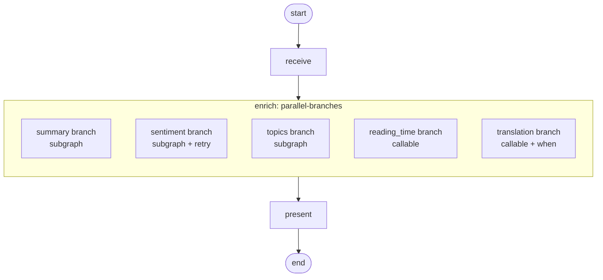

# Parallel branches

!!! info "Source"
    [https://github.com/LunarCommand/openarmature-python/blob/main/examples/parallel-branches/main.py](https://github.com/LunarCommand/openarmature-python/blob/main/examples/parallel-branches/main.py){target="_blank" rel="noopener"}

Enrich a lunar-mission news article with several independent analyses
(one-sentence summary, sentiment label, topic tags, reading-time
estimate, optional translation) running concurrently: some as
heterogeneous subgraphs, one as a lightweight inline function, and one
gated by a condition.

## Overview

Where fan-out (the fan-out-with-retry example) runs N copies of
*one* subgraph against different inputs, parallel-branches runs
M *heterogeneous* branches against the same input. Different state schemas,
different middleware, different topologies per branch, one
dispatch.

The article goes into several branches in parallel:

- **summary**: bare subgraph, one node, writes `summary` back.
- **sentiment**: subgraph wrapped in `RetryMiddleware` (the
  classification call is short and cheap to retry), writes a
  `label` back into the parent's `sentiment` field.
- **topics**: bare subgraph, writes a `tags` list back into the
  parent's `topics` field.
- **reading_time**: an inline `call` branch, not a subgraph. A plain
  async function over the parent state estimates reading time from the
  word count (no LLM, no projection) and returns the parent field
  directly.
- **translation**: a `call` branch gated by a `when` predicate. It runs
  only when `target_language` is set on the state; with it unset (the
  default) the branch is skipped entirely.

The branches don't depend on each other, so they fire concurrently and
the parent fans in once the dispatched branches complete.

## What it teaches

- [`add_parallel_branches_node`](../concepts/parallel-branches.md):
  M named `BranchSpec`s under one node. A branch gives its work as
  either a compiled `subgraph` (with per-branch input/output
  projection) or an inline `call`, plus optional per-branch middleware
  and an optional `when` predicate.
- Callable branches. `reading_time` is `BranchSpec(call=fn)`: an inline
  async function over the parent state that returns parent fields
  directly, with no subgraph, state schema, or projection. Reach for
  `call` when a leg is really just "run this one function" rather than a
  whole pipeline.
- Conditional `when`. `translation` carries
  `when=lambda s: bool(s.target_language)` and is skipped at dispatch
  unless a target language is requested: no dispatch, no contribution,
  no observer events. The other branches always run.
- Branches with *different* state schemas. The summary subgraph's
  state has a `summary` field; the sentiment subgraph's has
  `label`; the topics subgraph's has a `tags` list. The projection
  mappings translate between the branch's vocabulary and the
  parent's. Callable branches need no projection: they read and write
  parent fields directly.
- Heterogeneous per-branch middleware. The sentiment branch wraps
  its subgraph in retry; the others run bare. A production pipeline
  often wants different retry policies, timing windows, or custom
  middleware per branch.
- Branch insertion order = fan-in order. When two branches write to
  the same parent field, the parent's reducer applies them in the
  order they were declared in the `branches` mapping (not in
  completion order). The branches here write disjoint parent fields,
  so the order doesn't affect the result, but the property holds.
- A `branch_attribution_observer` reads `NodeEvent.branch_name`. It is
  populated for every event from inside a branch: the inner nodes of a
  subgraph branch and the single branch-unit event of a callable branch.
  Outer-graph nodes carry `branch_name=None`, and a skipped `when`
  branch emits no events at all. This is the per-event attribution that
  lets observability backends route metrics and spans by branch.

## How to run

```bash
uv sync --group examples
LLM_API_KEY=sk-... uv run python examples/parallel-branches/main.py
```

The article is baked into the example. Set `target_language` on the
input state to also run the translation branch.

## The graph



`enrich` is the parallel-branches node; the branches inside the box
dispatch concurrently against the same `article` field on parent state.
The summary, sentiment, and topics branches are subgraphs; reading_time
and translation are inline callables. The translation branch is gated by
`when` and is skipped in the default run.

## Reading the output

```
========================================================================
Lunar-mission article enrichment; independent analyses in parallel
========================================================================

Article (642 chars):

NASA's Artemis II crew capsule Integrity splashed down in the Pacific
Ocean this evening, ending a ten-day flight that carried four astronauts
on a free-return trajectory around the Moon and back...

  [observer] (branch=summary) node 'write_summary' started
  [observer] (branch=sentiment) node 'classify_sentiment' started
  [observer] (branch=topics) node 'extract_topics' started
  [observer] (branch=reading_time) node 'reading_time' started

========================================================================
Enrichment results
========================================================================

  summary:      <one-sentence summary>
  sentiment:    positive
  topics:       ['Artemis II', 'splashdown', 'lunar program']
  reading time: 36s
  translation:  (skipped by `when`; set target_language to enable)

  wall-clock: 1142.6 ms

The branches ran in parallel; wall-clock is closer to the slowest
single branch than to the sum of them all...
```

- **The observer lines** fire close together (often within a few ms of
  each other), confirming the branches dispatched in parallel rather
  than serially. There is no `translation` line: its `when` predicate
  was false, so the branch was skipped and emitted nothing.
- **The reading_time line** comes from a callable branch. It carries
  `branch_name` exactly like the subgraph branches' inner nodes, so
  per-branch attribution is uniform across both branch forms.
- **`branch_name` attribution** is what makes per-branch observability
  tractable. `write_summary` knows nothing about `branch_name`; it's
  the engine that tags the event for the observer.
- **Wall-clock under 1500 ms** for several LLM branches is the clearest
  indicator of parallelism. Run serially at roughly 1s each they would
  sum to several seconds; under parallel dispatch the wall-clock
  approaches the slowest branch's duration. The reading_time branch is
  effectively free (no LLM).
- **Disjoint output fields** mean the reducer order at fan-in doesn't
  matter here. If two branches both wrote to `summary`, the declared
  branch order would determine which value won under the default
  `last_write_wins` reducer.
```
