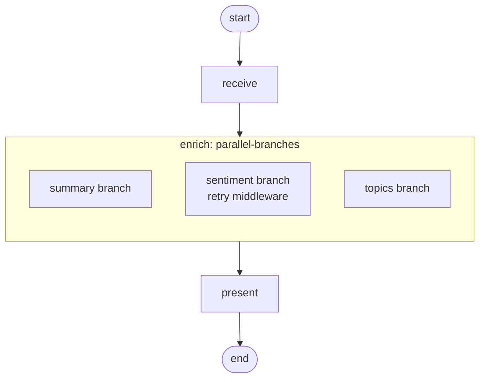

# Parallel branches

!!! info "Source"
    [https://github.com/LunarCommand/openarmature-python/blob/main/examples/parallel-branches/main.py](https://github.com/LunarCommand/openarmature-python/blob/main/examples/parallel-branches/main.py){target="_blank" rel="noopener"}

Enrich a lunar-mission news article with three independent
analyses (one-sentence summary, sentiment label, topic tags)
running concurrently as separate subgraphs.

## Overview

Where fan-out (the fan-out-with-retry example) runs N copies of
*one* subgraph against different inputs, parallel-branches runs
M *heterogeneous* subgraphs against the same input. Different state schemas,
different middleware, different topologies per branch, one
dispatch.

The article goes into three branches in parallel:

- **summary**: bare subgraph, one node, writes `summary` back.
- **sentiment**: subgraph wrapped in `RetryMiddleware` (the
  classification call is short and cheap to retry), writes a
  `label` back into the parent's `sentiment` field.
- **topics**: bare subgraph, writes a `tags` list back into the
  parent's `topics` field.

The branches don't depend on each other, so they fire concurrently
and the parent fans in once all three complete.

## What it teaches

- [`add_parallel_branches_node`](../concepts/parallel-branches.md):
  M named `BranchSpec`s under one node. Each spec carries its own
  compiled subgraph plus per-branch input/output projection plus
  optional per-branch middleware.
- Branches with *different* state schemas. The summary subgraph's
  state has a `summary` field; the sentiment subgraph's has
  `label`; the topics subgraph's has a `tags` list. The projection
  mappings translate between the branch's vocabulary and the
  parent's.
- Heterogeneous per-branch middleware. The sentiment branch wraps
  its subgraph in retry; the other two run bare. A production
  pipeline often wants different retry policies, timing windows, or
  custom middleware per branch.
- Branch insertion order = fan-in order. When two branches write to
  the same parent field, the parent's reducer applies them in the
  order they were declared in the `branches` mapping (not in
  completion order). The three branches here write disjoint parent
  fields, so the order doesn't affect the result, but the property
  holds.
- A `branch_attribution_observer` reads
  `NodeEvent.branch_name` on inner-node events. `branch_name` is
  populated only for events *inside* a branch's subgraph;
  outer-graph nodes carry `branch_name=None`. This is the
  per-event attribution that lets observability backends route
  metrics and spans by branch.

## How to run

```bash
uv sync --group examples
LLM_API_KEY=sk-... uv run python examples/parallel-branches/main.py
```

The article is baked into the example.

## The graph



`enrich` is the parallel-branches node; the three branches inside
the box dispatch concurrently against the same `article` field on
parent state. The sentiment branch is the only one with middleware
attached.

## Reading the output

```
========================================================================
Lunar-mission article enrichment - three independent analyses in parallel
========================================================================

Article (642 chars):

NASA's Artemis II crew capsule Integrity splashed down in the Pacific
Ocean this evening, ending a ten-day flight that carried four astronauts
on a free-return trajectory around the Moon and back...

  [observer] (branch=summary) inner node 'write_summary' started
  [observer] (branch=sentiment) inner node 'classify_sentiment' started
  [observer] (branch=topics) inner node 'extract_topics' started

========================================================================
Enrichment results
========================================================================

  summary:   <one-sentence summary>
  sentiment: positive
  topics:    ['Artemis II', 'splashdown', 'lunar program']

  wall-clock: 1142.6 ms

The three branches ran in parallel - wall-clock is closer to the
slowest single branch than to the sum of all three.
```

- **The three observer lines** fire close together (often within a
  few ms of each other), confirming the branches dispatched in
  parallel rather than serially.
- **`branch_name` attribution** is what makes per-branch
  observability tractable. `write_summary` knows nothing about
  `branch_name`; it's the engine that tags the event for the
  observer.
- **Wall-clock under 1500 ms** for three sequential LLM calls is
  the clearest indicator of parallelism. Three serial calls at
  roughly 1s each would land near 3 seconds; under parallel
  dispatch the wall-clock approaches the slowest branch's duration.
- **Disjoint output fields** mean the reducer order at fan-in
  doesn't matter here. If two branches both wrote to `summary`, the
  declared branch order (`summary` before `sentiment` before
  `topics`) would determine which value won under the default
  `last_write_wins` reducer.
