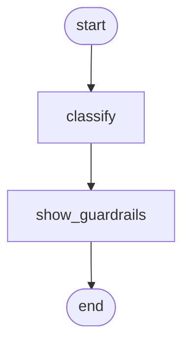

# Provider extras

!!! info "Source"
    [https://github.com/LunarCommand/openarmature-python/blob/main/examples/provider-extras/main.py](https://github.com/LunarCommand/openarmature-python/blob/main/examples/provider-extras/main.py){target="_blank" rel="noopener"}

Reach a vendor knob openarmature does not model, and watch the
guardrails that stop you reaching the wrong one.

## Overview

You classify lunar telemetry alerts in bulk. Two of the things you
want are provider-specific rather than portable, so there is no
first-class field for either: `service_tier` to take the cheaper,
slower lane for a batch nobody is waiting on, and `logit_bias` to
stop the model emitting a severity label your team retired last
quarter. Both are real OpenAI request fields. Neither means
anything on another provider.

`extras` is where those go. It is a named container on the runtime
config, and whatever you put in it rides to the wire untouched.
That is the whole feature, and it exists so a provider-specific
knob does not require either a fork or a framework release.

The interesting half is what it refuses. A field openarmature
already models is managed, and putting it in `extras` as well is an
error rather than an override, because two sources of truth for one
wire field is a bug you want at the call site and not in a trace
three days later.

## What it teaches

- `RuntimeConfig(extras={...})` carrying anything the framework does
  not model. `service_tier` and `logit_bias` arrive on the request
  body verbatim.
- **A key naming a field this call produced is rejected.** Setting
  `temperature=0.2` and also `extras={"temperature": 0.9}` raises
  `ProviderInvalidRequest` naming the key and both values.
- **Managed means "produced by this call", not "nameable".** A
  sampling field you leave unset is not managed on that call, so
  `extras={"temperature": 0.9}` with no `temperature=` rides
  through. This is the one that surprises people, and it is what
  makes `extras` usable as an escape hatch for a field the framework
  models but you did not set.
- **A matching value is a no-op, not an error.** Sending `0.2` in
  both places is not ambiguous, so it is allowed.
- **Structural keys are managed unconditionally.** `model`,
  `messages`, `tools` and `tool_choice` are managed whether or not
  the mapping produced the field, so a *conflicting* value rejects
  even on a call whose body carries nothing of that name. A matching
  value is still a no-op, by the same rule as above. The asymmetry is
  deliberate: it is what stops an `extras` tool array from reaching
  the wire on a no-tools call without passing tool validation.
- **`stop` merges instead of colliding**, because it realizes the
  same wire field as `stop_sequences`. Both lists arrive,
  concatenated and de-duplicated.

## How to run

```bash
uv run python examples/provider-extras/main.py
```

**No credentials, no endpoint.** The demo installs a stub transport
and prints the outbound request body, because the shape of that body
*is* the subject: whether a knob reached the wire, and what happened
when it collided with one the framework manages. A real endpoint
answers neither question any better, and every refusal happens
before a request is sent.

To watch a real provider accept the knobs, drop the `transport=`
argument from `_provider()` and supply a real `base_url` and
`api_key`.

## The graph



`classify` runs the alerts with the two passthrough knobs set.
`show_guardrails` then attempts the collisions and records what
came back, so the accepted and refused cases print side by side from
one run.

## Reading the output

```
=== openarmature provider-extras demo ===
alerts: 3

classified:
  [watch] Regolith intake auger current 18% above nominal for 40 seconds, ...
  [watch] South-pole relay lost carrier for 3 frames during Earth occultat...
  [watch] Battery bus B cell 4 reading 0.2V under its siblings at end of c...

the knobs that reached the wire:
  service_tier = 'flex'
  logit_bias = {'24886': -100}
  temperature = 0.0

what extras refuses:
  temperature in both: refused, extras key 'temperature' conflicts with the
    mapping-managed wire field 'temperature' (managed value 0.2, extras value
    0.9); a managed field cannot be overridden via extras
  tools via extras: refused, extras key 'tools' conflicts with the
    mapping-managed wire field 'tools' (managed value None, extras value
    <list of 1>); a managed field cannot be overridden via extras
  stop merges rather than collides: accepted
```

Three things in that output are the point.

- **The wire block** is read off the body the stub captured, not
  from the config. `service_tier` and `logit_bias` are there because
  nothing manages them; `temperature` is there because the mapping
  produced it.
- **`managed value None`** on the `tools` refusal is the structural
  rule showing its work. The call declared no tools, so the managed
  value is `None`, and a list conflicts with that. Every other entry
  in the table is unmanaged on a call that did not produce it, so the
  same extras key would have ridden through.
- **`stop` accepted** is the merge arm. It is the only managed field
  in the OpenAI mapping that combines rather than collides.

The error messages name the key and both values, so the fix is
readable from the message without reaching for the mapping table.
