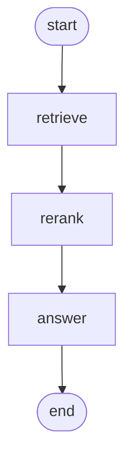

# Retrieval-augmented answering

!!! info "Source"
    [https://github.com/LunarCommand/openarmature-python/blob/main/examples/retrieval-rag/main.py](https://github.com/LunarCommand/openarmature-python/blob/main/examples/retrieval-rag/main.py){target="_blank" rel="noopener"}

Answer a question about the Moon from a small corpus of passages,
using the two-stage retrieval pattern before generation.

## Overview

You have eight passages of lunar reference material and a question.
Stuffing all eight into the prompt would work at this size and stop
working at a thousand, so the pipeline narrows instead: find the
plausibly-relevant passages cheaply, reorder them accurately, and
ground the answer in the few that survive.

Four steps, and the middle two are the interesting ones.

1. **Index**, once and offline. Batch-embed every passage. `embed`
   over a list returns one vector per input in input order, so the
   index lines up positionally with the corpus and no separate id
   map is needed.
2. **Retrieve**, per query. Embed the question, rank the corpus by
   cosine similarity, keep the top four. Cheap and broad: it buys
   recall, not precision.
3. **Rerank** those four with a cross-encoder, which scores each
   candidate against the query directly rather than comparing two
   independently-computed vectors. More accurate and more
   expensive, which is why it runs over four candidates instead of
   the whole corpus. Two survive.
4. **Generate** from the two reranked passages.

Retrieval gives recall, reranking gives precision, and the split is
what makes the cost work: the expensive comparison runs over a
shortlist the cheap one produced.

## What it teaches

- `OpenAIEmbeddingProvider` from `openarmature.retrieval`. Batch
  `embed` for the index, single `embed` for the query. One vector
  per input, in input order, both times.
- `EmbeddingRuntimeConfig(input_type=...)`, the query-versus-document
  knob. On OpenAI it is a wire no-op because the model is symmetric,
  and it is set anyway: the same call selects the correct
  representation on an asymmetric provider, so the pipeline moves to
  TEI, Cohere or Jina without a code change. Setting a field that
  does nothing today is what keeps it portable.
- `CohereRerankProvider.rerank`, returning `ScoredDocument` results
  sorted by relevance.
- **Mapping results back by index, not by text.** Cohere does not
  echo the document body, so `ScoredDocument.document` is `None` and
  the only way home is `ScoredDocument.index`, which points into the
  candidate list you passed. The example translates that back to a
  corpus index. A pipeline that matched on returned text would work
  against a provider that echoes and break against one that does not.
- `RerankRuntimeConfig(return_documents=True)` asking for the echo
  where a provider supports it.
- **Retrieval providers driven inside node bodies**, so their
  `EmbeddingEvent` and `RerankEvent` reach an attached observer the
  same way an LLM completion does. The offline index build runs
  outside the graph deliberately, and emits nothing: there is no
  invocation to attribute it to.
- An `OpenAIProvider` answer node grounded in the reranked passages.

## How to run

```bash
uv sync --group examples
OPENAI_API_KEY=sk-... COHERE_API_KEY=... \
  uv run python examples/retrieval-rag/main.py
```

Both keys are required: OpenAI serves the embeddings and the answer,
Cohere serves the rerank.

| Variable | Default | Notes |
| --- | --- | --- |
| `OPENAI_API_KEY` | required | embeddings and the answer |
| `OPENAI_BASE_URL` | `https://api.openai.com` | host root, no `/v1` |
| `OPENAI_EMBED_MODEL` | `text-embedding-3-small` | |
| `OPENAI_CHAT_MODEL` | `gpt-4o-mini` | |
| `COHERE_API_KEY` | required | rerank |
| `COHERE_RERANK_MODEL` | `rerank-v3.5` | |

`OPENAI_BASE_URL` takes the host root. The provider appends the
`/v1` routes itself, so a URL that already ends in `/v1` is
rejected rather than producing a doubled path.

## The graph



Linear, because each stage narrows the input to the next. The index
build is not a node: it runs once before the first `invoke`, outside
any graph.

State carries corpus indices rather than passage text between
stages. `candidate_indices` after retrieval, `ranked_indices` after
reranking, both best-first, the second a reordered and trimmed
subset of the first.

## Reading the output

```
indexed 8 passages

   [obs] embed  retrieve: 1 in / 1536d
   [obs] rerank rerank: 4 in / top 2
Q: Why did Apollo 13 not land on the Moon?
   retrieved: [3, 0, 6, 1]
   reranked:  [3, 6]
   A: <a grounded one-paragraph answer>
```

The indices are what to watch, and the two lines together show the
rerank doing its job.

- **`indexed 8 passages`** is the offline build. It prints no
  observer line, because it ran outside the graph.
- **`[obs] embed retrieve: 1 in / 1536d`** is the per-query embed,
  inside the node, so it reaches the observer. One input, and the
  dimensionality the model returned.
- **`[obs] rerank rerank: 4 in / top 2`** is `_RETRIEVE_K` in and
  `_RERANK_K` out.
- **`retrieved`** is cosine order, best-first. **`reranked`** is a
  subset in a different order. If the reranked list is the first
  two of the retrieved list unchanged, the cross-encoder agreed with
  cosine on that query, which happens and is not a failure. The
  interesting case is the one above, where a passage cosine ranked
  third is promoted over the two above it.

The specific indices and the answer text depend on the models you
point at, so treat the numbers as shape rather than as expected
output.
