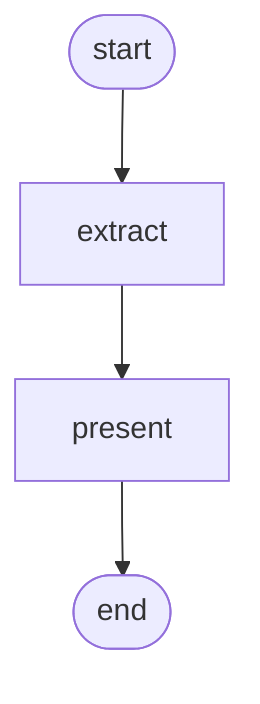

# Structured-output reask

!!! info "Source"
    [https://github.com/LunarCommand/openarmature-python/blob/main/examples/structured-output-reask/main.py](https://github.com/LunarCommand/openarmature-python/blob/main/examples/structured-output-reask/main.py){target="_blank" rel="noopener"}

Pull a structured mission record out of a prose lunar-landing
report, and recover when the reply arrives unusable.

## Overview

A feed delivers lunar-landing reports as free prose. You want one
row per report: mission, operator, landing site, outcome, and the
mass delivered in kilograms. A JSON schema says exactly that.

You also cap output tokens, because the records are small and you
pay by the token. That cap is a guess about the longest record you
will ever need, and the guess is sometimes wrong. When it is, the
model stops mid-object and the reply that arrives is a fragment:
valid so far, parseable as nothing. The schema boundary rejects it
exactly as it rejects a model that answered in prose.

Retrying the identical request reproduces the identical fragment,
because nothing about the request changed. Two things have to
change, and they are different kinds of thing.

- **What you say.** Show the model what came back and what was
  wrong with it. That is `reask`: you supply the corrective
  message, because only you know how to talk to your model about
  your schema.
- **What it is allowed to spend.** A correction cannot help a reply
  that gets cut off at the same place. That is
  `per_attempt_override`: the retry runs under a raised ceiling.

Supply only the first and the retry is better informed and still
truncated. The demo's three modes exist to make that visible rather
than asserted.

## Why the ceiling, and not the wrong-shaped answer

The ceiling is the failure this demo can guarantee, on any endpoint
and any model. The wrong-shaped answer is the one you are more
likely to meet, and whether you meet it is a property of your
serving stack rather than of your model.

A schema reaches a model through two channels only: the endpoint
enforces it while decoding, or the call puts it in the prompt. An
endpoint that enforces it cannot return a wrong shape. One that
accepts `response_format` and ignores it, or a proxy that drops the
field, leaves neither channel open, and a model that was never told
the field names invents plausible ones. A stronger model does not
fix that.

Both failures arrive at the same exception, so one builder covers
both. What the builder puts in the correction is what decides
whether it recovers.

## What it teaches

- `complete(response_schema=...)` raising `StructuredOutputInvalid`
  rather than handing back a half-built object. A truncated reply
  and a wrong-typed field arrive through the same door.
- `LlmRetryConfig(reask=...)` making that failure retryable **for
  this call**. Without a builder it is terminal, which is the right
  default: a schema the model cannot satisfy is usually a bug in the
  schema, not a transient.
- The builder reading four fields off the exception:
  `output_content` (verbatim, what the model actually sent),
  `error_message` (what the reader objected to), `finish_reason`
  (`"length"` when the ceiling ended the reply) and
  `response_schema` (the shape that was asked for).
- **Branching on `finish_reason`, because the two failures need
  different information rather than different wording.** A truncated
  reply already acted on the schema and ran out of room, so
  resending it the schema tells it nothing. A complete-and-wrong
  reply usually never saw the schema at all.
- **Sending the schema, not only the objection.** `error_message`
  names the first violation validation found, so a correction
  quoting only it spends an attempt per wrong field. The schema is
  the whole contract at once.
- `LlmRetryConfig(per_attempt_override=...)` applying a config
  schedule to retries only. Attempt 0 runs the caller's config
  untouched; each retry merges the next entry over it, and a
  schedule shorter than the retry count carries its last entry
  forward.
- The framework appending the model's reply as an `assistant` turn
  and the correction as a `user` turn, so the conversation stays
  role-alternating and the model sees its own fragment in context.
  It authors no prompt of its own; every word sent is yours.
- Reask sharing the `max_attempts` budget with transient retries. A
  call that burns two attempts on unusable output has one left for a
  rate limit.

## How to run

```bash
uv sync --group examples
LLM_API_KEY=sk-... uv run python examples/structured-output-reask/main.py

MODE=nocap LLM_API_KEY=sk-... uv run python examples/structured-output-reask/main.py
MODE=off   LLM_API_KEY=sk-... uv run python examples/structured-output-reask/main.py
```

| `MODE` | Posture |
| --- | --- |
| unset (default) | corrective message **and** raised ceiling |
| `nocap` | corrective message, ceiling left alone |
| `off` | neither |

Point `LLM_BASE_URL` at any OpenAI-compatible endpoint, as the host
root rather than its `/v1` path. `LLM_MODEL` defaults to a small
fast model.

## The graph



`extract` loops the reports, running one `complete` per report with
the retry config the mode selected. A report that never recovers
lands in `state.failures` instead of `state.records`, so one bad
report does not abort the batch.

## Reading the output

The three modes on one endpoint, same reports, same schema:

```
mode: reask  (corrective message + raised token ceiling)
cap: 32 output tokens, raised to 256 on retry

  IM-3  |  Intuitive Machines  |  Reiner Gamma  |  landed  |  1340 kg
  Chandrayaan-4  |  ISRO  |  south pole  |  landed  |  620 kg
  Peregrine Flight 2  |  unknown  |  Sinus Viscositatis  |  unconfirmed  |  90 kg

extracted 3 of 3
```

```
mode: nocap  (corrective message, ceiling left alone)
cap: 32 output tokens

  unrecovered:
    Unterminated string starting at: line 1 column 82: {"landing_site": "Reiner Gamma", "mass_kg": 1340, ...
    ...
extracted 0 of 3
```

```
mode: off  (neither)
cap: 32 output tokens

  unrecovered:
    Unterminated string starting at: line 1 column 70: {"landing_site": "Reiner Gamma", "mass_kg": 1340, ...
    ...
extracted 0 of 3
```

**`nocap` is the arm that carries the lesson.** The model is told
exactly what went wrong and still has nowhere to put the answer, so
every attempt is cut off and the budget drains. Compare the column
numbers between `off` and `nocap`: the fragments get slightly
longer, because the model heeded "keep every value short" and still
ran out of room. Being better informed bought a few characters.

`Peregrine Flight 2 | unknown` is the model being right, not wrong.
The report says "the operator has not yet confirmed" and never names
the operator, so `unknown` is the correct extraction from the text
alone.

The fragments arrive as a JSON parse error rather than a schema
violation, because a truncated object is not well-formed. That is
why the builder branches on `finish_reason` instead of on the
message: `"length"` identifies a spend problem, and no amount of
reading the parse error would.
