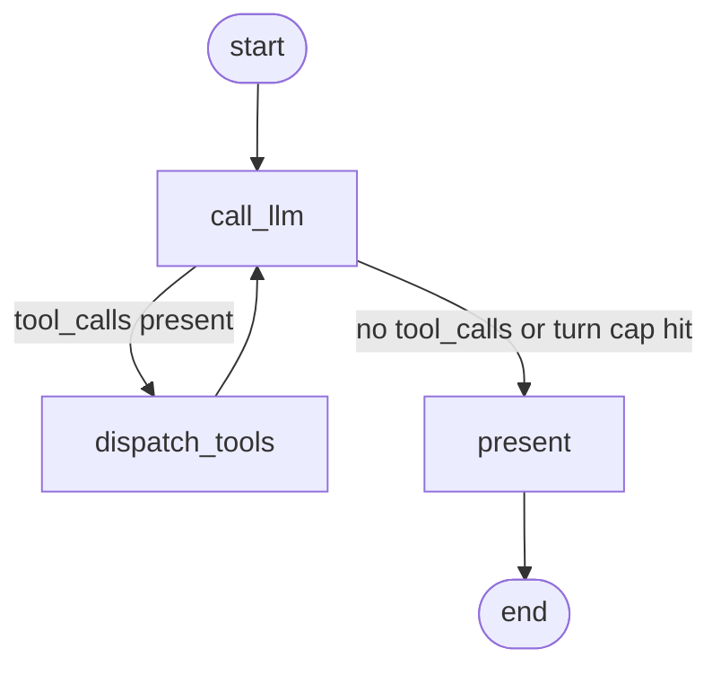

# Tool use

!!! info "Source"
    [https://github.com/LunarCommand/openarmature-python/blob/main/examples/tool-use/main.py](https://github.com/LunarCommand/openarmature-python/blob/main/examples/tool-use/main.py){target="_blank" rel="noopener"}

A lunar-mission assistant that calls local Python tools to answer
questions mixing fact recall and physics arithmetic about Apollo
and Artemis missions.

## Overview

A user asks something that mixes a factual recall ("when did
Apollo 13 splash down?") with a small computation ("what's the
delta-v for a Hohmann transfer from a 300 km parking orbit to
lunar distance?"). Neither belongs in the model's prompt: facts
get stale and arithmetic is unreliable from the model alone. The
agent defines two local tools and lets the model call them.

The agent loop:

1. Send the running message list (plus tool definitions) to the
   model.
2. If the model returns `tool_calls`, dispatch each to its local
   Python function, append the results as `ToolMessage`s, and call
   the model again.
3. When the model returns a normal assistant message (no
   `tool_calls`), present it as the final answer.

A `MAX_TURNS` cap (5 here) prevents runaway loops.

## What it teaches

- [`Tool(name, description, parameters)`](../concepts/llms.md)
  defining each function as a JSON Schema. The two tools here use
  the standard `type: object` shape with `required` properties; the
  model receives them via `complete(messages, tools=TOOLS)`.
- [`ToolCall(id, name, arguments)`](../concepts/llms.md) records
  parsed from the model's response. The framework guarantees
  `arguments` is a parsed dict matching the tool's parameters
  schema (or `None` only under `finish_reason="error"`).
- [`ToolMessage(content, tool_call_id)`](../concepts/llms.md)
  round-trip. The `tool_call_id` must match the `id` the model
  emitted so it can pair its request with the response.
- The **agent loop as a graph cycle**:
  `call_llm → dispatch_tools → call_llm → present → END`
  with a [conditional edge](../concepts/graphs.md) from `call_llm`
  routing to either `dispatch_tools` (more tool calls requested),
  `present` (model is done), or `present` (turn cap exceeded). No
  special "agent framework" abstraction; tool-calling composes with
  existing graph mechanics.
- Defensive handling: `tc.arguments is None` returns a clear error
  string the model can react to; `try/except` around `dispatch`
  catches `KeyError` / `ValueError` / `TypeError` and surfaces them
  the same way.

## How to run

```bash
uv sync --group examples
LLM_API_KEY=sk-... uv run python examples/tool-use/main.py
```

Pass a question on the command line:

```bash
LLM_API_KEY=sk-... uv run python examples/tool-use/main.py \
  "When was Apollo 17 launched?"
```

With no arg, the default is a multi-part question combining a
mission lookup with a delta-v computation, which usually forces at
least two tool calls before the model presents an answer.

## The graph



The cycle is `call_llm → dispatch_tools → call_llm`, exited by the
conditional edge from `call_llm` to `present`. `route_after_llm`
returns `"present"` if `s.turn >= MAX_TURNS` (hard cap) or if the
last message has no `tool_calls` (model is done); otherwise
`"dispatch_tools"`.

## Reading the output

For the default multi-part question, expect something like:

```
========================================================================
Lunar-mission assistant - tool-calling loop
========================================================================

  question: Tell me about Apollo 13. Then, separately, if I were
  planning a similar free-return-style mission and wanted to inject
  from a 300 km parking orbit to apogee at the Moon's mean distance
  (384,400 km above Earth's surface), roughly how much delta-v would
  that take?

  turns:     2
  tools used: 2

  trace:
    - call_llm[turn=1]
    - dispatch_tools[2]
    - call_llm[turn=2]
    - present

  final answer:
    Apollo 13 launched 11 April 1970 with Lovell, Swigert, and Haise
    aboard; an oxygen tank rupture in the service module aborted the
    landing and the crew returned safely via free-return on 17 April
    1970. For your hypothetical free-return injection from a 300 km
    parking orbit to apogee at the Moon's mean distance...
    [continues with delta-v values from the tool]
```

- **`turns: 2`** means `call_llm` ran twice. Turn 1 produced
  tool_calls (the model decided to use both tools); turn 2
  produced the final answer with no tool_calls, and the conditional
  edge routed directly to `present`. (The cap of 5 is never hit on
  the happy path.)
- **`tools used: 2`** counts `ToolMessage`s appended. The model
  emitted two `ToolCall`s in one assistant turn (one for
  `lookup_mission`, one for `compute_delta_v`); the dispatcher
  produced two `ToolMessage`s back. A `tool_call_count` over
  `turns - 1` indicates the model batched calls.
- **`trace`** shows the loop structure clearly: each `call_llm`
  step is tagged with its turn number; `dispatch_tools[N]` records
  how many tools that step ran.
- **Order of tool calls vs replies.** Inside a `dispatch_tools`
  step, the implementation preserves order: the assistant message's
  `tool_calls` list is iterated in order, and one `ToolMessage` is
  appended per call. The model relies on `tool_call_id` to pair
  requests with responses, but the in-order appending keeps logs
  scannable.
- **Failure mode.** If the model emits a `ToolCall` with
  unparseable arguments (only happens under
  `finish_reason="error"`), `dispatch_tools` appends a
  `ToolMessage` with an error string instead of raising. The next
  turn lets the model react to the error and either retry or
  give up.
